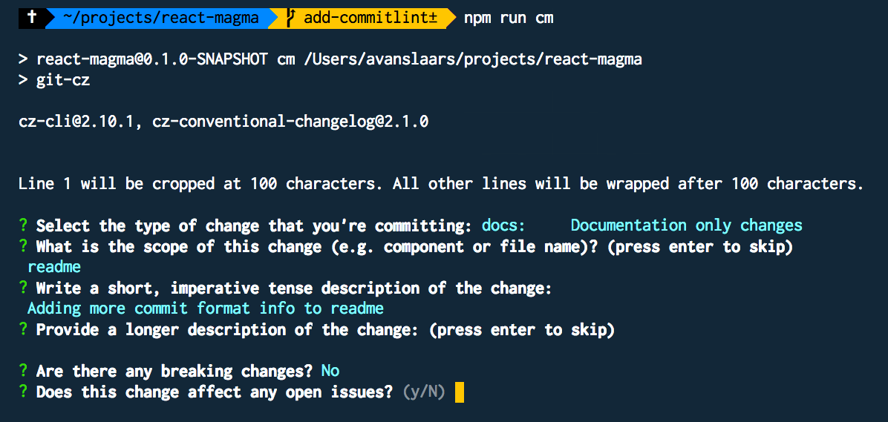

# React magma

## Getting started

_TODO: Add install instructions_

[React Magma Documentation](http://react-magma.apps.dev.cengage.io/)

## Contributing

### Dependencies

Node v8.9.4 or greater with npm 5.7.0 or greater

### Steps to run documentation locally

1. Clone this repo: `git clone ssh://git@stash.corp.web:7999/front/react-magma.git`
2. `npm ci` - using `ci` instead of `install` will install dependencies based on `package-lock.json` and should speed up the install
3. `npm run docs`
4. Go to [http://localhost:3000](http://localhost:3000) to view the documentation

Note: If you get errors about a missing typescript module during step three, you may need to run `npm i -s -D typescript` from `packages/react-magma-native` and rerun the previous two commands.

### Committing code

In order to adhere to [SemVer](https://semver.org/), manage release channels (`latest`, `next`, `previous`, `x.x.x-beta.x`, etc.), automate the creation of a consistent changelog and eventually automate releases, our commit messages will follow [the conventional commit format](https://www.conventionalcommits.org/en/v1.0.0-beta.2/). This is enforced with a `commit-msg` hook via [Husky](https://github.com/typicode/husky) which also runs linting, prettier and tests prior to allowing a commit.

#### Commit format:

All commits will have a topic and short description with an optional subject.

There is a short version of the format that will pass the `commit-msg` check and a longer version for handling changes that need more explanation and for marking commits that contain breaking changes.

**TL;DR: It's a good idea to understand the commit message format, but there is a script in place that will walk you through this to make it easier to adhere to this commit format. see the "Tooling" heading below**

##### Commit message components:

- type (required)
- subject
- description (required)
- body
- footer (required _if_ there are breaking changes)

###### Types

The type is key in determining how to bump the version number in the next version number change. Available types are:

- `feat` - commit adds a new feature
- `fix` - commit fixes a bug
- `docs` - commit changes documentation only
- `test` - commit adds missing tests or corrects existing tests
- `refactor` - commit only has refactoring, code has changed but behavior and tests retain original functionality
- `perf` - like refactor, but the focus is on performance
- `build` - changes that affect the build system or external dependencies
- `ci` - commit changes CI configuration files
- `revert` - reverts a previous commit
- `style` - Changes that do not affect the meaning of the code (white-space, formatting, missing semi-colons, etc)
- `chore` - other changes that don't modify source or test files

###### Subject

The subject is an optional identifier. For example, if adding a new feature to a `Modal` component, you might use `modal` as your subject to provide context.

###### Description

Short description of the commit. The `commitlint` rules enforce a max length of 72 characters for the header, which is made up of the type, subject and description, along with the added characters to match the commit format, for example: `feat(modal):added support for closing via esc key`

###### Body

If the short description isn't enough to cover the details of your change, you can add more text in the body to expand on what the commit does and provide all the details you want.

###### Footer

The footer is where you designate a breaking change. So if you add a feature and that necessitates breaking changes to the existing API, you would use `feat` for the type and in the footer, you would add `BREAKING CHANGE: description of the breaking change`

##### Short commit message format

```bash
#format - with subject
git commit -m "<topic>(<subject>): <short description>"

#example - with subject
git commit -m "feat(button): Added icon capabilities to button"

#format - no subject
git commit -m "<topic>: <short description>"

#example - no subject
git commit -m "feat: Added icon capabilities to button"
```

##### Long commit message format (with a breaking change)

```bash
#format
git commit -m "<type>(subject): <short description>

<optional body>

<optional footer>"

#example
git commit -m "feat(button): Added icon capabilities to button

More verbose description of what was added with the icon feature of the button.

BREAKING CHANGE: description of what part of the API brakes with this commit"
```

##### Tooling

To facilitate getting the commit format right, you can create your commit messages by adding the files you want to commit with `git add <files>` then by running `npm run cm`, which will step you through the individual parts of the commit message.

###### Selecting a topic from the predefined list


###### Walking through the remaining questions



###### The resulting commit produced by the wizard


###### Retry

If the `pre-commit` scripts prevent your commit due to a test or linting failure, you can fix those items, `git add` those updates and rather than going through the commit message wizard again, you can retry with `npm run cm-retry`.
